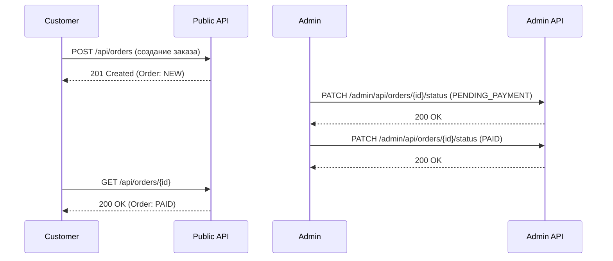
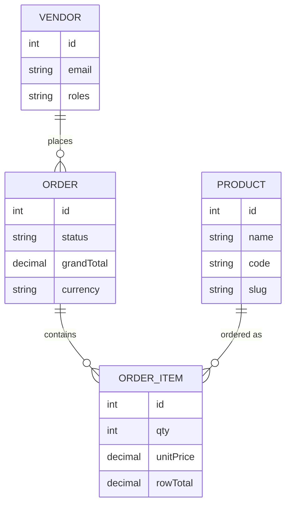
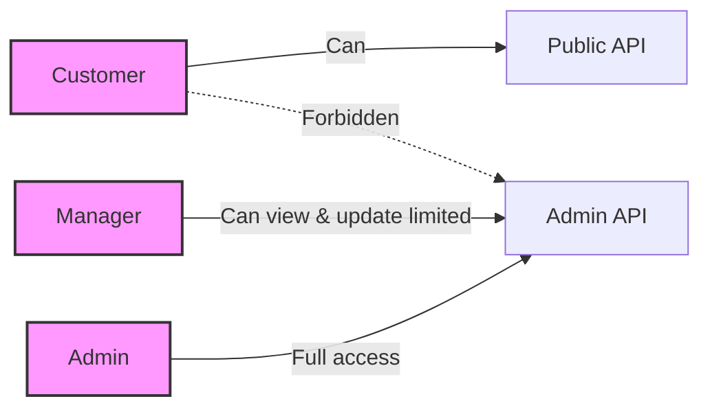
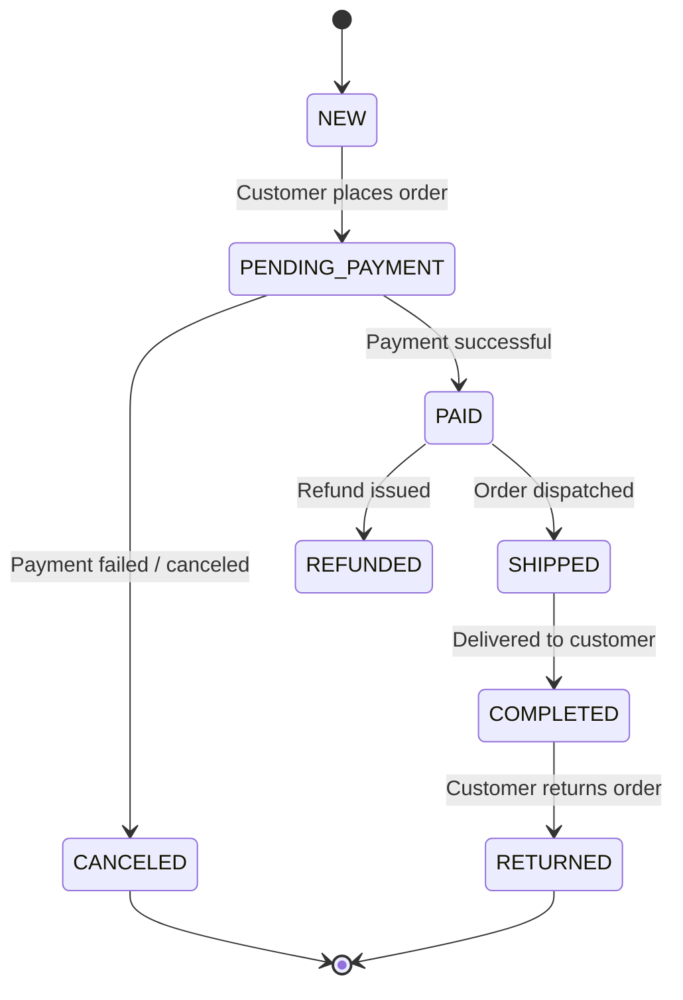
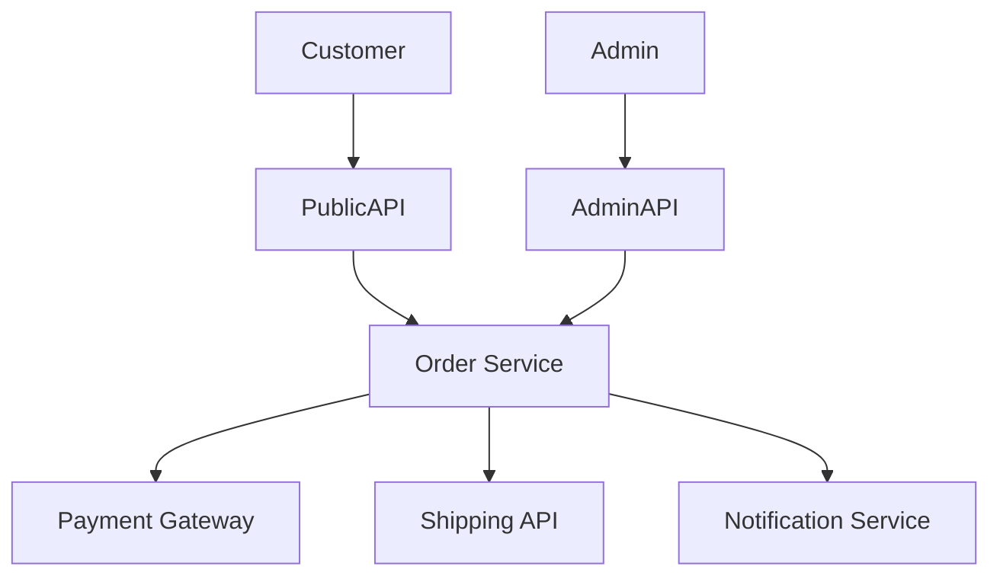
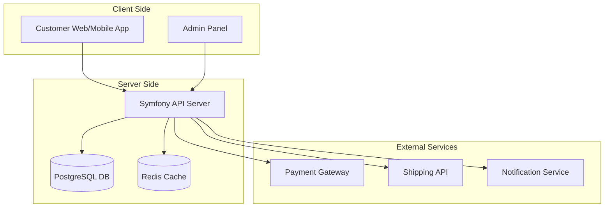

# API Documentation & Tools

Этот каталог содержит все необходимые материалы для работы и тестирования API.

## Содержимое

- **openapi.yaml** — полная спецификация API (Swagger/OpenAPI 3.0)  
- **postman_collection.json** — Postman Collection с примерами запросов  
- **postman_environment.json** — Postman Environment с переменными `baseUrl` и `token`  
- **insomnia_workspace.yaml** — Insomnia workspace (авто-логин с JWT)  
- **insomnia_workspace_refresh_stub.yaml** — Insomnia workspace c заготовкой для refresh-токена

## Использование

### Swagger UI
```bash
docker run -p 8080:8080 -e SWAGGER_JSON=/openapi.yaml -v $(pwd)/openapi.yaml:/openapi.yaml swaggerapi/swagger-ui
```
Открой: [http://localhost:8080](http://localhost:8080)

### Postman
1. Импортируй `postman_collection.json`  
2. Импортируй `postman_environment.json`  
3. Включи окружение **E-Commerce API Env**  
4. Задай JWT токен в переменной `token` или выполни логин-запрос

### Insomnia
1. Импортируй `insomnia_workspace.yaml` (или `insomnia_workspace_refresh_stub.yaml`)  
2. Перейди в папку **Auth → Login**  
3. Введи правильные email/пароль и выполни запрос  
4. Токен автоматически сохранится в `{{ token }}`  
5. Все админские запросы будут использовать его в `Authorization: Bearer`

Если твой API поддерживает refresh-токен:
- Используй `insomnia_workspace_refresh_stub.yaml`
- Выполни `Auth → Refresh Token`, чтобы обновить `{{ token }}`

---

## Диаграмма API-потоков



## Диаграмма архитектуры слоёв

```mermaid
graph TD
    A[Entities] --> B[DTOs]
    B --> C[Public API Controllers]
    C --> D[SmartCrud / Admin Controllers]
    D --> E[Security Layer (Voter / IsGranted)]
    E --> F[Persistence (Doctrine / DB)]
```

## ER-диаграмма сущностей



## Диаграмма ролей и прав доступа



## Жизненный цикл заказа (Order Lifecycle)



## Диаграмма интеграций



## Диаграмма деплоймента



---

⚡ Рекомендация: держать эти файлы в каталоге `/docs` репозитория, чтобы команда могла ими пользоваться.
